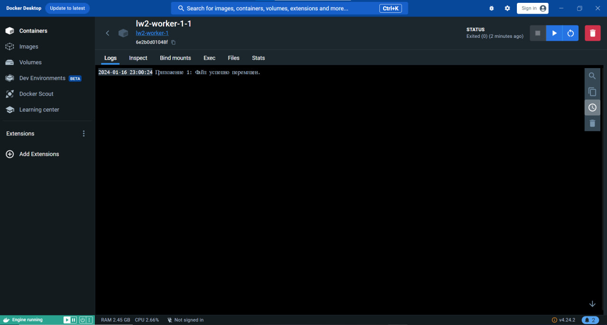
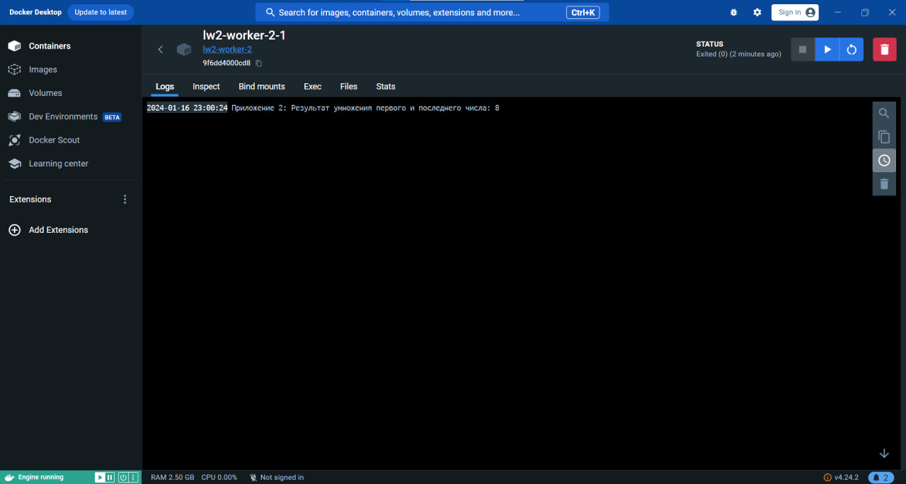

# Лабораторная работа 2. 

### Задание
**Цель**: изучение техники создания простого распределённого приложения.

**Задачи**:

- Разработать два приложения такие, что результат первого является исходными данными для второго.
- Изучить файлы сборки образов docker и разработать их для созданных приложений.
- Собрать файл docker-compose.yml для запуска приложений.
- Разобраться с монтированием каталогов из хост-системы.

**Вариант**:
- Ищет в каталоге /var/data файл с самым коротким названием и перекладывает его в /var/result/data.txt.
- Сохраняет произведение первого и последнего числа из файла /var/data/data.txt в /var/result/result.txt.

### Как запустить лабораторную работу
В директории с файлом характеристик docker-compose.yaml выполнить команду:
```
docker-compose -f docker-compose.yaml up
```
### Описание лабораторной работы

#### Входные данный

В качестве входных данных представлены следующие файлы с соответствующим содержанием:

```
deadlock - file1: 9 5 0 1
diamond - file2: 3 5 8
himera - file3: 4 6 6
kjjuriositi - file4: 3 5 3
nitric-oxide - file5: 3 1 7
V3001TH - file6: 7 2 6
za - file7: 2 4 4
```

#### Первое приложение
Первое приложение выполняет задачу: Ищет в каталоге /var/data файл с самым коротким названием и перекладывает его в /var/result/data.txt.

Для этого напишем следующий код:

```java
File dataDir = new File("/var/data");
File resultDir = new File("/var/result");
// Получаем все файлы в каталоге /var/data
File[] files = dataDir.listFiles();
if (files != null && files.length > 0) {
    // Ищем файл с самым коротким названием
    File shortestFileName = files[0];
    for (File file : files) {
        if (file.getName().length() < shortestFileName.getName().length()) {
            shortestFileName = file;
        }
    }
    // Перекладываем файл в /var/result/data.txt
    File destination = new File(resultDir, "data.txt");
    try {
        Files.move(shortestFileName.toPath(), destination.toPath(), StandardCopyOption.REPLACE_EXISTING);
        System.out.println("Файл успешно перемещен.");
    } catch (IOException e) {
        System.out.println("Ошибка при перемещении файла: " + e.getMessage());
    }
} else {
    System.out.println("В каталоге /var/data нет файлов.");
}
```

Также создадим *Dockerfile*, который используется для создания образа контейнера данного приложения.

```dockerfile
# Используем образ Java для компиляции и запуска кода
FROM openjdk:11
# Создание директорий для файлов
RUN ["mkdir", "/var/data"]
RUN ["mkdir", "/var/result"]
# Устанавливаем рабочую директорию внутри контейнера
WORKDIR /app
# Копируем исходный код в контейнер
COPY src/Main.java .
# Компилируем исходный код
RUN javac Main.java
# Устанавливаем команду запуска приложения
CMD ["java", "Main"]
```
#### Второе приложение

Второе приложение выполняет задачу: Сохраняет произведение первого и последнего числа из файла /var/data/data.txt в /var/result/result.txt.

Для этого напишем следующий код:

```java
String inputFile = "/var/result/data.txt";
String outputFile = "/var/result/result.txt";

try (BufferedReader reader = new BufferedReader(new FileReader(inputFile));
    BufferedWriter writer = new BufferedWriter(new FileWriter(outputFile))) {

    String line;
    while ((line = reader.readLine()) != null) {
        String[] numbers = line.split("\\s+");

        if (numbers.length > 0) {
            int firstNumber = Integer.parseInt(numbers[0]);
            int lastNumber = Integer.parseInt(numbers[numbers.length - 1]);
            int result = firstNumber * lastNumber;

            writer.write(String.valueOf(result));
            writer.newLine();
        }
    }
} catch (IOException e) {
    e.printStackTrace();
}
```

Также создадим *Dockerfile*, который используется для создания образа контейнера данного приложения.

```dockerfile
# Используем образ Java для компиляции и запуска кода
FROM openjdk:11
# Создание директорий для файлов
RUN ["mkdir", "/var/data"]
RUN ["mkdir", "/var/result"]
# Устанавливаем рабочую директорию внутри контейнера
WORKDIR /app
# Копируем исходный код в контейнер
COPY src/Main.java .
# Компилируем исходный код
RUN javac Main.java
# Устанавливаем команду запуска приложения
CMD ["java", "Main"]
```

### Разворачивание сервисов

Создадим файл docker-compose.yml, который определяет настройки для запуска нескольких сервисов в Docker с использованием Docker Compose. 

Первый блок будет определять первый сервис worker-1. Он будет создан на основе контекста сборки /worker-1 и файла Dockerfile. Затем, указанные тома (volumes) будут примонтированы в контейнере. В данном случае, директория .\data на хосте будет примонтирована в /var/data внутри контейнера, а директория .\result на хосте будет примонтирована в /var/result внутри контейнера.

```dockerfile
  worker-1:
    build:
      context: /worker-1
      dockerfile: Dockerfile
    volumes:
      - .\data:/var/data
      - .\result:/var/result
```

Второй блок будет определять второй сервис worker-2. Он зависит от сервиса worker-1, поэтому worker-1 будет запущен перед worker-2. Затем, он также будет создан на основе контекста сборки /worker-2 и файла Dockerfile. Аналогично, указанные тома будут примонтированы в контейнере.

```dockerfile
  worker-2:
    depends_on:
      - worker-1
    build:
      context: /worker-2
      dockerfile: Dockerfile
    volumes:
      - .\result:/var/data
      - .\result:/var/result
```

### Запуск






Файлы директории data:

```
deadlock - file1: 9 5 0 1
diamond - file2: 3 5 8
himera - file3: 4 6 6
kjjuriositi - file4: 3 5 3
nitric-oxide - file5: 3 1 7
V3001TH - file6: 7 2 6
za - file7: 2 4 4
```

Файлы директории result:

```
data: 2 4 4
result: 8
```
### Видео

https://disk.yandex.ru/i/dFIB-vOqlAip9g