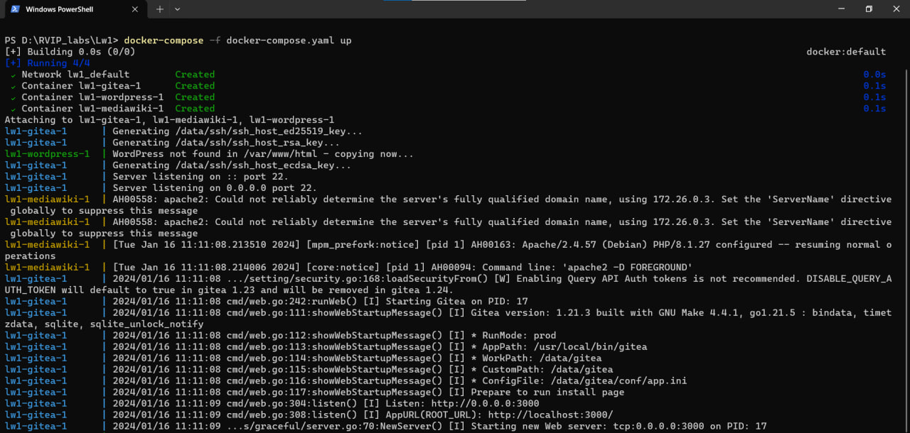
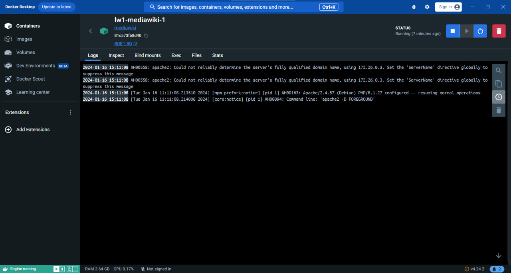
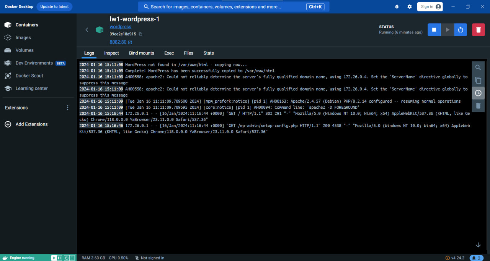
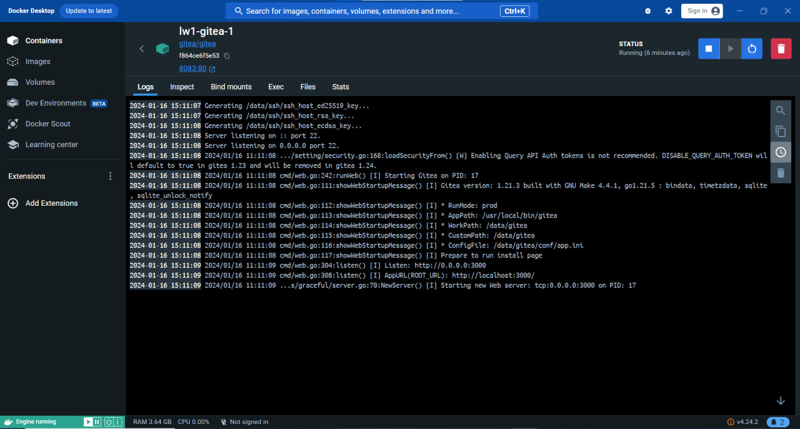

# Лабораторная работа 1. 

### Задание
**Цель**: изучение современных технологий контейнеризации.

**Задачи**:

- Установить средство контейнеризации docker.
- Изучить применение и принципы docker.
- Изучить утилиту docker-compose и структуру файла docker-compose.yml.
- Развернуть не менее 3х различных сервисов при помощи docker-compose.

### Как запустить лабораторную работу
В директории с файлом характеристик docker-compose.yaml выполнить команду:
```
docker-compose -f docker-compose.yaml up
```
### Разворачивание сервисов

Выбранные сервисы:
- mediawiki
- wordpress
- gitea
- redmine

#### Разворачивание mediawiki
Конфигурации сервиса в `docker-compose.yaml`:
```yaml
mediawiki:  # название сервиса
    image: mediawiki  # образ, который скачиывается с DockerHub
    volumes:
      - ./mediawiki_data:/var/data  # создание volumes, который будет использоваться для хранения данных MediaWiki 
    ports:
      - 8081:80 # открывает порт 8080 на хостовой машине, который будет проксирован на порт 81 внутри контейнера.
```

#### Разворачивание wordpress

```yaml
wordpress:  # название сервиса
    image: wordpress  # образ, который скачиывается с DockerHub
    volumes:
      - ./wordpress_data:/var/data  # создание volumes, который будет использоваться для хранения данных wordpress 
    ports:
      - 8082:80 # открывает порт 8080 на хостовой машине, который будет проксирован на порт 82 внутри контейнера.
  
```

#### Разворачивание gitea
```yaml
gitea:  # название сервиса
    image: gitea/gitea  # образ, который скачиывается с DockerHub
    ports:
      - 8083:80  # открывает порт 8080 на хостовой машине, который будет проксирован на порт 83 внутри контейнера.
    volumes:
      - ./gitea_data:/var/data  # создание volumes, который будет использоваться для хранения данных gitea 
```

### Запуск сервисов









### Видео 

https://disk.yandex.ru/i/-5BiuM51iqj83A