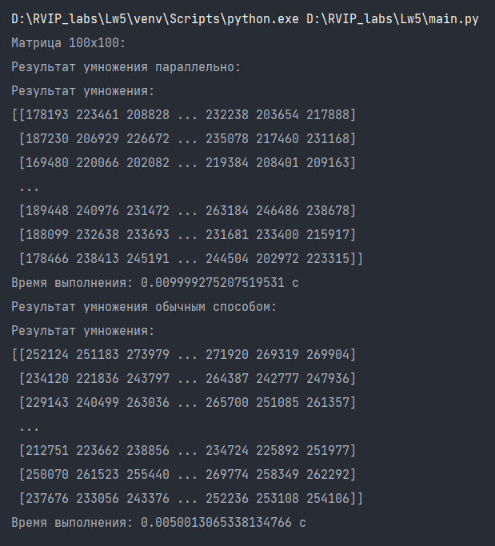
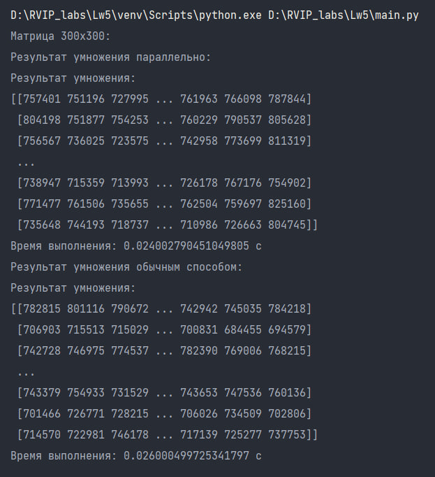
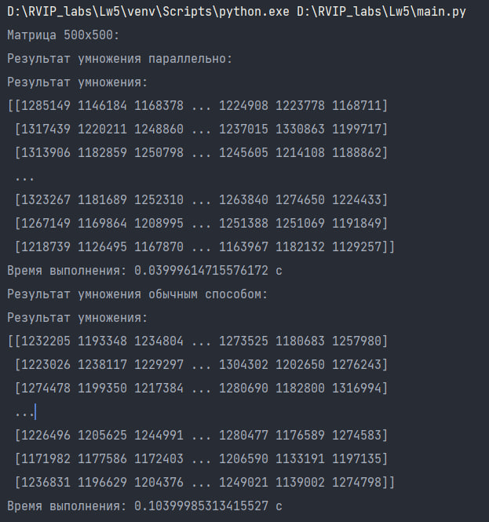

# Лабораторная работа 5. 

### Задание

**Задачи**:

Реализовать умножение двух больших квадратных матриц.
Сделать два алгоритма: обычный и параллельный (задание со * - реализовать это в рамках одного алгоритма). В параллельном алгоритме предусмотреть ручное задание количества потоков (число потоков = 1 как раз и реализует задание со *), каждый из которых будет выполнять умножение элементов матрицы в рамках своей зоны ответственности.


### Как запустить лабораторную работу
В директории с файлом характеристик docker-compose.yaml выполнить команду:
```
docker-compose -f docker-compose.yaml up
```

### Описание лабораторной работы

Для реализации параллельного умножения матриц с использованием многопоточности создадим несколько функций:

1. Функция `multiplication_rows(row, matrix_b)`

Данная функция используется для перемножения входной строки row на матрицу matrix_b и возвращает результат умножения.

```python
def multiplication_rows(row, matrix_b):
    return np.dot(row, matrix_b)
```

2. Функция `parallel_matrix_multiplication(matrix_a, matrix_b, num_threads)`

Данная функция Принимает две матрицы `matrix_a` и `matrix_b`, а также количество потоков `num_threads`, которое ровно количеству строк в первой матрице. Также осуществляется проверка на то, что размеры матрицы совместимы.

Затем создается пул потоков с использованием `concurrent.futures.ThreadPoolExecutor` и устанавливает максимальное количество потоков равным `num_threads`. Запускается таймер для измерения времени выполнения умножения матриц. Создается список `results` и
для каждой строки матрицы `matrix_a` запускает функцию `multiplication_rows` в отдельном потоке с помощью `executor.submit()`. Результаты сортируются по индексу строки и объединяются в матрицу  в правильном порядке с помощью `np.vstack()`. Завершается таймер и происходит замер времени, затраченного на выполнение задачи.

```python
def parallel_matrix_multiplication(matrix_a, matrix_b, num_threads):
    num_rows_a, num_cols_a = matrix_a.shape
    num_rows_b, num_cols_b = matrix_b.shape
    assert num_cols_a == num_rows_b, "Размеры матриц несовместимы"

    with concurrent.futures.ThreadPoolExecutor(max_workers=num_threads) as executor:
        start_time = time.time()
        results = []
        for i in range(num_rows_a):
            result = executor.submit(multiplication_rows, matrix_a[i], matrix_b)
            results.append((i, result))
        sorted_results = sorted(results, key=lambda x: x[0])
        result_matrix = np.vstack(
            [result.result() for _, result in sorted_results])
        end_time = time.time()

    execution_time = end_time - start_time
    return result_matrix, execution_time
```

3. Функция `test(parallel)`

Данная функция создает две матрицы с фиксированными значениями. И происходит разбиение на два алгоритма вычисления умножения матриц: обычный и параллельный.Если `parallel` равно True, вызывает `parallel_matrix_multiplication()` с `num_threads=2`, иначе с `num_threads=1`.

4. Функции `matrix100x100(parallel)`, `matrix300x300(parallel)` и `matrix500x500(parallel)`

В данных функция создается пара случайных матриц размером *100x100*, *300x300* и *500x500* со значениями от 0 до 100. 

Если `parallel` равно `True`, вызывают `parallel_matrix_multiplication()` с `num_threads` равным размеру матрицы, иначе с `num_threads=1`.
Выводят результат умножения и время выполнения.

Пример функции для матрицы размером *100x100*:

```python
def matrix100x100(parallel):
    a = np.random.randint(0, 100, size=(100, 100))
    b = np.random.randint(0, 100, size=(100, 100))
    if parallel:
        result = parallel_matrix_multiplication(a, b, num_threads=100)
    else:
        result = parallel_matrix_multiplication(a, b, num_threads=1)
    print("Результат умножения:")
    print(result[0])
    print("Время выполнения: " + str(result[1]) + " с")
```

#### Результаты выполнения последовательного и параллельного алгоритма на умножение двух матриц размером 100x100, 300x300, 500x500 элементов.
Результат перемножения матриц 100х100:



Результат перемножения матриц 300х300:



езультат перемножения матриц 500х500:



Таким образом, можно сделать вывод о том, что умножение матрицы параллельным способом значительно ускоряет процесс выполнения по сравнению с обычным способом на больших объемах данных. В случае матрицы размером 500х500, время выполнения параллельного умножения составляет всего 0.03999614715576172 с, в то время как обычный способ занимает 0.10399985313415527 с. Однако случае матрицы размером 100х100, время выполнения параллельного умножения составляет 0.008999347686767578 с, в то время как обычный способ занимает 0.006066799163818359 с, и перемножение обычным алгоритмом является более выгодным по временнным затратам, чем паралелльным.
Параллельное умножение матрицы может быть полезным в случаях, когда требуется обработать большие объемы данных и ускорить процесс вычислений.

### Видео 

https://disk.yandex.ru/i/uJzemvtUlgmR2g