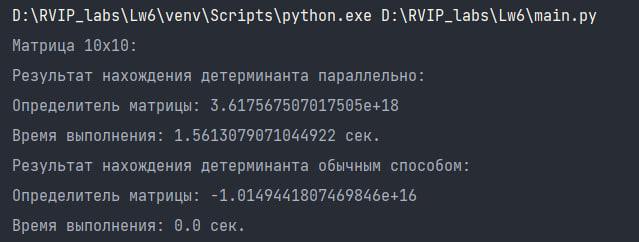
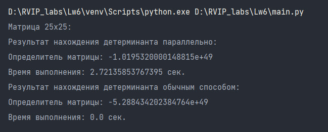
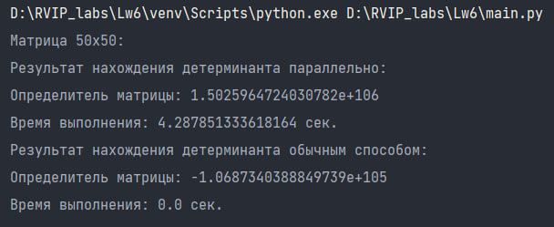

# Лабораторная работа 6. 

### Задание

**Задачи**:

Реализовать нахождение детерминанта квадратной матрицы. Сделать два алгоритма: обычный и параллельный (задание со * - реализовать это в рамках одного алгоритма). В параллельном алгоритме предусмотреть ручное задание количества потоков (число потоков = 1 как раз и реализует задание со *), каждый из которых будет выполнять нахождение отдельной группы множителей.


### Как запустить лабораторную работу
В директории с файлом характеристик docker-compose.yaml выполнить команду:
```
docker-compose -f docker-compose.yaml up
```

### Описание лабораторной работы

Для реализации параллельного нахождения детерминанта квадратной матрицы с использованием многопоточности создадим несколько функций:

1. Функция `calculate_determinant(args)`

Данная функция принимает матрицу и номер элемента, по которому ищется минор. Если `i` нечетное число, множитель умножается на -1.
Удаляет первую строку из `matrix` с помощью функции `np.delete(matrix, 0, axis=0)`.
Удаляет столбец `i` из `matrix` с помощью функции `np.delete(matrix, i, axis=1)`.
Возвращает определитель полученной подматрицы, умноженный на множитель.

```python
def calculate_determinant(args):
    matrix, i = args
    multiplier = matrix[0][i]
    if i % 2 != 0:
        multiplier *= -1
    matrix = np.delete(matrix, 0, axis=0)
    submatrix = np.delete(matrix, i, axis=1)
    return np.linalg.det(submatrix) * multiplier
```

2. Функция `parallel_determinant(matrix, parallel)`

Данная функция принимает матрицу, для которой нужно вычислить определитель, и флаг, указывающий, следует ли использовать параллельное вычисление. Далее вычисляется размер матрицы `n` с `помощью matrix.shape[0]`. Если флаг указывает на использование параллельного вычисления, создается пул процессов с `n` процессами с помощью `Pool(processes=n)`. Затем создается цикл по значениям от `0` до `n`.
Для каждого значения `i` добавляет в список `results` результат выполнения функции `calculate_determinant` с аргументами `matrix` и `i`. Затем закрывается пул процессов и ожидается завершения всех процессов с помощью `pool.close()` и `pool.join()`. Далее суммируются все значения из списка results с помощью `np.sum([res.get() for res in results])`, сохраняет результат в переменную result и также вычисляется затраченное время на вычисление определителя.

3. Функция `test(parallel)`

Данная функция принимает значение флага, указывающего на использование параллельного или обычного вычисления. Также создает  матрицу mx размером 3x3 и выполняет вычисление определителя матрицы mx с помощью функции `parallel_determinant(mx, parallel)`.

4. Функции `matrix10x10(parallel)`, `matrix25x25(parallel)` и `matrix50x50(parallel)`

Т.к. на моем устройстве не возможно вычислять детерминат матрицы размером более 100х100, то вместо использования матриц размером 100x100, 300x300, 500x500 элементов были созданы матрицы 10х10, 25х25, 50х50.

В функциях `matrix10x10(parallel)`, `matrix25x25(parallel)` и `matrix50x50(parallel)` принимается аргумент `parallel`, указывающий, следует ли использовать параллельное вычисление. Создаются матрицы размером 10x10, 25x25 и 50x50 со случайными целочисленными значениями от 0 до 100. И выполяются вычисления определителя для каждой матрицы с помощью функции `parallel_determinant`. 

#### Результаты выполнения последовательного и параллельного алгоритма на вычисление детерминанта квадратных матриц 10х10, 25х25, 50х50.

Результат вычисления детерминанта матрицы 10х10:



Результат вычисления детерминанта матрицы 25х25:



Результат вычисления детерминанта матрицы 50х50:



Таким образом, можно сделать вывод о том, что вычисления обычным алгоритмом выполняются быстрее, чем при использовании параллельного способа нахождения детерминанта. Если точность результата является наиболее приоритетным фактором, то использование параллельного способа может быть предпочтительным. В случае, когда время выполнения играет решающую роль, обычный алгоритм может быть более эффективным выбором. Кроме того, для дальнейшего улучшения производительности вычислений можно рассмотреть возможность оптимизации параллельного способа нахождения детерминанта, например, с использованием более эффективных алгоритмов или распределения вычислений на более мощные вычислительные узлы.


### Видео 

https://disk.yandex.ru/i/i8qDyMhn6nCk9A