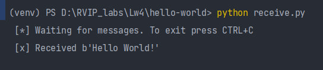
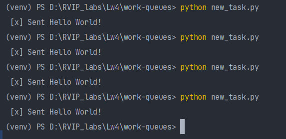
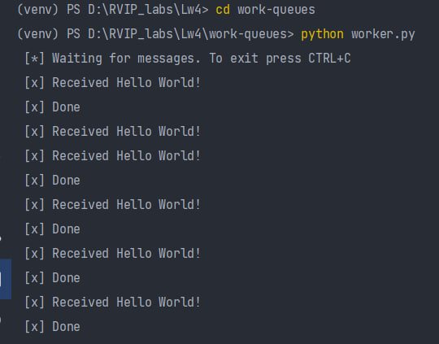
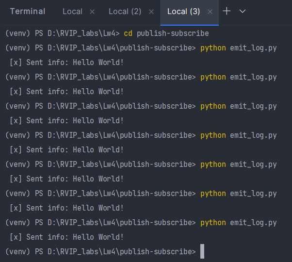
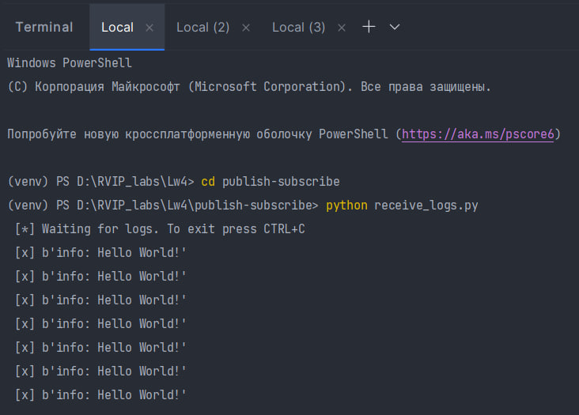
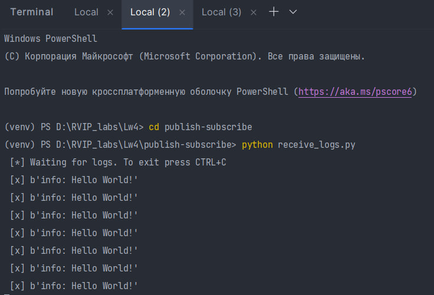
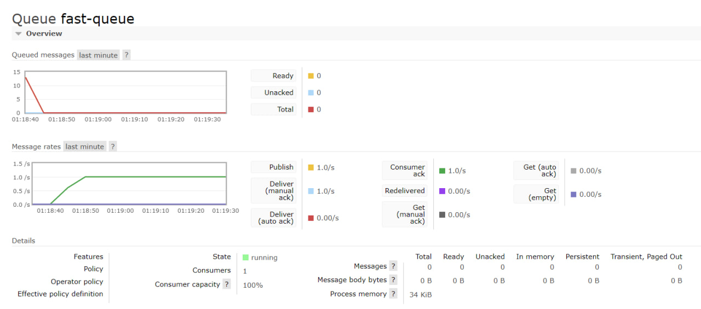
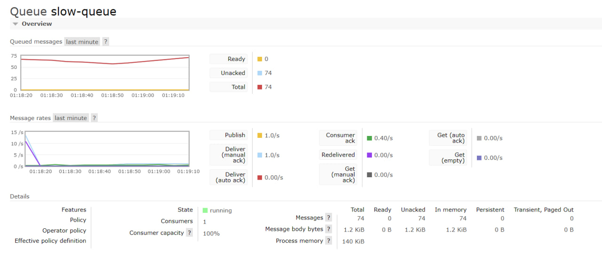

# Лабораторная работа 4. 

### Задание
**Цель**: изучение проектирования приложений при помощи брокера сообщений.

**Задачи**:

- Установить брокер сообщений RabbitMQ.
- Пройти уроки 1, 2 и 3 из RabbitMQ Tutorials на любом языке программирования.
- Продемонстрировать работу брокера сообщений.

### Как запустить лабораторную работу
В директории с файлом характеристик docker-compose.yaml выполнить команду:
```
docker-compose -f docker-compose.yaml up
```
### Описание лабораторной работы
#### Прохождение tutorial

**1. *"Hello world"***

Результат работы producer:


Результат работы consumer:



**2. *"Work Queues"***

Результат работы producer:


Результат работы consumer:


**3. *"Publish/Subscribe"***

Результат работы producer:


Результат работы consumer1:


Результат работы consumer2:



#### Разработка демонстрационных приложений
Для разработки демонстрационных приложений была выбрана предметная область прошлой лабораторной  работы, состоящая из тренировок и упражнений.

Согласно заданию необходимо создать:
1. Publisher, которая создаёт один exchange с типом fanout.

Для этого создадим список logs, который хранит различные сообщения логов, которые могут быть отправлены.

```python
logs = ["started exercise", "finished exercise", "started training", "finished training"]
```

Установим соединение с локальным *RabbitMQ* сервером на `localhost` и создадим канал связи с *RabbitMQ* для отправки и получения сообщений.

```python
connection = pika.BlockingConnection(pika.ConnectionParameters('localhost'))
channel = connection.channel()
```

Далее определим имя обмена в *RabbitMQ*, в данном случае logs и объявем обмен с указанным именем и типом fanout, что означает, что все сообщения, отправленные в этот обмен, будут отправлены всем подписчикам, которые присоединены к нему.
```python
exchange_name = 'logs'
channel.exchange_declare(exchange=exchange_name, exchange_type='fanout')
```

Для того, чтобы программа раз в секунду генерировала сообщения в журнал событий создадим цикл, в котором будет выбираться случайное сообщение из списка `logs`, публиковаться в обмен `logs` без указания ключа маршрутизации (сообщение будет доставлено всем подписчикам этого обмена). И также укажем задержку в 1 секунду между каждой публикацией сообщения.
```python
while 1:
    log = random.choice(logs)
    channel.basic_publish(exchange=exchange_name, routing_key='', body=log)
    print(f" [x] Published: {log}")
    time.sleep(1)
```

2. Consumer 1, которая создаёт под себя отдельную не анонимную очередь, создаёт binding на exchange и начинает принимать сообщения. Программа должна обрабатывать сообщения 2-3 секунды.

Создадим функцию `message_manager`, которая принимает три аргумента: `channel` (канал связи с RabbitMQ), `queue_name` (имя очереди) и `exchange_name` (имя обмена).
Затем объявляем очеред с указанным именем, связываем очередь с обменом, чтобы сообщения из этого обмена были доставлены в эту очередь.

Также создаем функцию `callback`, которая будет вызываться при получении нового сообщения из очереди. В данной функции происходит декодирование полученного сообщения из байтового формата в строку, вывод результата в консоль и имитация обработки сообщения с помощью задержки сообщения на 2-3 секунды. В зависимости от полученного значения декодированого сообщения, происходит вывод сообщение о статусе обработки, а также происходит подтверждение успешной обработки сообщения.

```python
    def callback(ch, method, properties, body):
        task = body.decode()
        print(f" [x] Received : {task}")
        time.sleep(random.randint(2, 3))
        if task == "started exercise":
            print(" [x] Started timer")
        elif task == "finished exercise":
            print(" [x] Stopped timer, started another exercise")
        elif task == "started training":
            print(" [x] Started manage exercise")
        else:
            print(" [x] Result of training given")
        ch.basic_ack(delivery_tag=method.delivery_tag)
```

Далее устанавливаем обработчик callback для сообщений из указанной очереди и запускаем  бесконечный цикл получения и обработки сообщений из очереди.
Таким образом, функция `message_manager` выглядет следующим образом:

```python
def message_manager(channel, queue_name, exchange_name):
    channel.queue_declare(queue=queue_name)
    channel.queue_bind(exchange=exchange_name, queue=queue_name)

    def callback(ch, method, properties, body):
        task = body.decode()
        print(f" [x] Received : {task}")
        time.sleep(random.randint(2, 3))
        if task == "started exercise":
            print(" [x] Started timer")
        elif task == "finished exercise":
            print(" [x] Stopped timer, started another exercise")
        elif task == "started training":
            print(" [x] Started manage exercise")
        else:
            print(" [x] Result of training given")
        ch.basic_ack(delivery_tag=method.delivery_tag)

    channel.basic_consume(queue=queue_name, on_message_callback=callback)
    print("[*] Waiting for messages. To exit press CTRL+C")
    channel.start_consuming()
```

Далее создаем соединение с *RabbitMQ*, создаем канал и определяем имя обмена и имя очереди. Затем, создаем поток `consumer_thread`, который вызывает функцию `message_manager` с передачей канала, имени очереди и имени обмена в качестве аргументов. После этого, поток запускается и ожидает его завершения с помощью `consumer_thread.join()`, чтобы основной поток программы не завершился до завершения работы обработчика сообщений.

```python
connection = pika.BlockingConnection(pika.ConnectionParameters('localhost'))
channel = connection.channel()
exchange_name = 'logs'
queue_name = 'slow-queue'

consumer_thread = threading.Thread(target=message_manager, args=(channel, queue_name, exchange_name))
consumer_thread.start()
consumer_thread.join()
```


3. Consumer 2. Аналогично Consumer 1, только сообщения необходимо обрабатывать моментально и имя очереди должно отличаться от Consumer 1.

Аналогично создаем подключение к серверу  с помощью `pika.BlockingConnection`,создаем канал для обмена сообщениями с помощью `connection.channel()`. Определяем имя обменника *"logs"* и имя очереди *"fast-queue"*. Далее объявляем саму очередь с данным именем. 

```python
connection = pika.BlockingConnection(pika.ConnectionParameters('localhost'))
channel = connection.channel()
exchange_name = 'logs'
queue_name = 'fast-queue'

channel.queue_declare(queue=queue_name)
channel.queue_bind(exchange=exchange_name, queue=queue_name)
```

После чего создаем функцию `callback`, которая будет вызываться при получении сообщений из очереди. Функция принимает параметры `ch` (канал), `method` (метод доставки), `properties` (свойства сообщения) и `body` (тело сообщения). В данном случае, функция аналогично декодирует тело сообщения в строку и выводит соответствующее сообщение в зависимости от значения `task`.
```python
def callback(ch, method, properties, body):
    task = body.decode()
    print(f" [x] Received : {task}")
    if task == "started exercise":
        print(" [x] Started timer")
    elif task == "finished exercise":
        print(" [x] Stopped timer, started another exercise")
    elif task == "started training":
        print(" [x] Started manage exercise")
    else:
        print(" [x] Result of training given")
    ch.basic_ack(delivery_tag=method.delivery_tag)

```
Код будет ожидать и обрабатывать сообщения, пока не будет прерван.

Результат работы быстрой очереди:


Результат работы медленной очереди:


Таким образом, можно сделать вывод о том, что в очереди fast-queue сообщения обрабатываются мгновенно, а в очереди slow-queue они обрабатываются с задержкой и в следствии этого сообщения накапливаются в очереди.

### Видео 

https://disk.yandex.ru/i/Qei-5DvhovOBJA